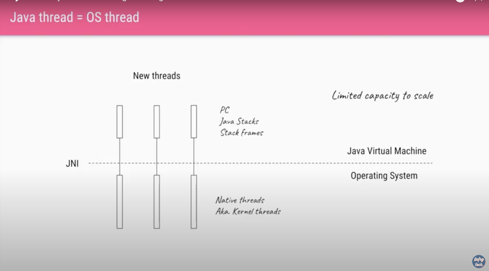
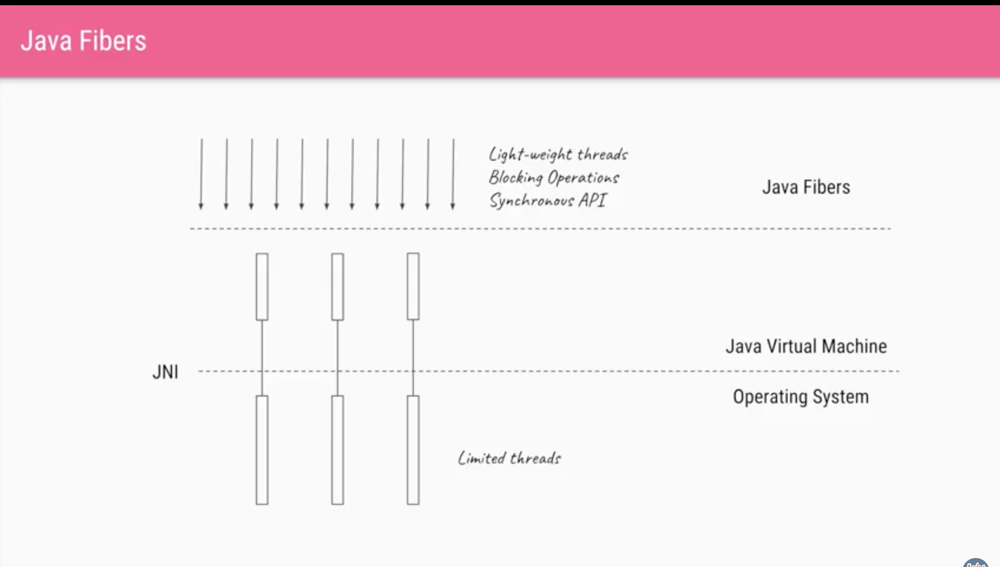

# Asynch

**Data Locality :** When Core1 is processing the task and sudden
it switches to other thread then it needs push the Local cache 
to shared and start processing new task.

**Scheduler Overhead :** When we are having many threads then scheduling the thread 
will become overhead to JVM

