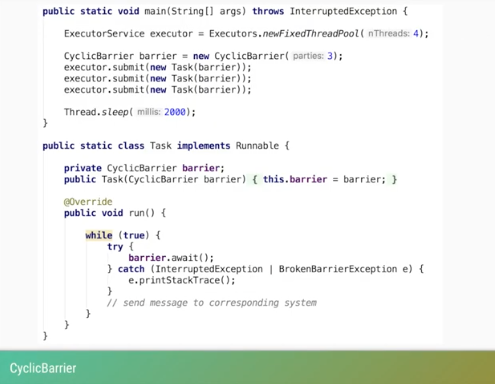

# CountDownLatch , CyclicBarrier and Phaser

**CountDownLatch**

`by using a CountDownLatch we can cause a thread to block until 
other threads have completed a given task.`

**Cyclic Barrier**

`CyclicBarriers are used in programs in which we have a fixed number of 
threads that must wait for each other to reach a common point before 
continuing execution.`

